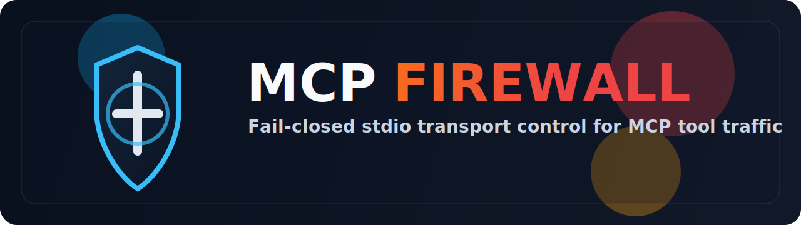

# MCP Transport Firewall - Fail-Closed MCP Stdio Firewall

<p align="center">
  
</p>

<p align="center">
  <strong>Fail-closed stdio transport firewall for MCP JSON-RPC tool traffic.</strong>
</p>

<p align="center">
  <a href="https://www.npmjs.com/package/mcp-transport-firewall"></a>
  <a href="LICENSE"></a>
  <a href="docs/INTEGRATION_CONTRACT.md"></a>
  <a href="docs/INTEGRATION_CONTRACT.md"></a>
  <a href="docs/STDIO_BENCHMARK_SNAPSHOT.json"></a>
</p>

<p align="center">
  <a href="docs/CLIENT_CONFIGS.md">Client Configs</a> |
  <a href="docs/INTEGRATION_CONTRACT.md">Integration Contract</a> |
  <a href="docs/THREAT_MODEL.md">Threat Model</a> |
  <a href="docs/VALIDATION_GUIDE.md">Validation Guide</a> |
  <a href="docs/ARTIFACT_PACK.md">Artifact Pack</a> |
  <a href="docs/ARCHITECTURE.md">Architecture</a> |
  <a href="docs/RELEASE_CHECKLIST.md">Release Checklist</a>
</p>

`mcp-transport-firewall` is a model-agnostic interception layer that sits between an MCP client and local or downstream tool servers. The primary security boundary is `stdio`. The runtime inspects MCP-shaped JSON-RPC messages before tool execution, denies unsafe traffic by default, sanitizes downstream output, and emits reproducible evidence through tests, demos, metrics, and a public npm package.

<table>
  <tr>
    <td width="33%">
      <strong>Primary surface</strong><br />
      stdio firewall between an MCP client and a local or downstream MCP tool server
    </td>
    <td width="33%">
      <strong>Secondary surface</strong><br />
      HTTP companion harness for route registration and compatibility testing
    </td>
    <td width="33%">
      <strong>Control plane</strong><br />
      admin API, React dashboard, and Prometheus-formatted metrics exporter
    </td>
  </tr>
</table>

<h2>Package Contract</h2>

```bash
npx mcp-transport-firewall
npx mcp-transport-firewall --help
npm install -g mcp-transport-firewall
```

Canonical package integration paths:

- standalone bundled MCP server
- protected downstream MCP server
- protected read-only file and search workflow

See [docs/CLIENT_CONFIGS.md](docs/CLIENT_CONFIGS.md) for tested client configuration examples and [docs/INTEGRATION_CONTRACT.md](docs/INTEGRATION_CONTRACT.md) for the stable runtime contract.

<h2>Quickstart</h2>

1. Install dependencies.

```bash
npm install
npm --prefix ui install
```

2. Copy the example environment.

```powershell
Copy-Item .env.example .env
```

3. Run the reproducible verification path.

```bash
npm run verify:all
npm run benchmark:stdio
```

4. Run the short stdio proof.

```bash
npm run demo:stdio
```

5. Run the Docker monolith when you want the HTTP harness, dashboard, and metrics endpoint together.

```bash
docker compose up --build
```

Control-plane endpoints:

- [http://localhost:3000/health](http://localhost:3000/health)
- [http://localhost:9090/health](http://localhost:9090/health)
- [http://localhost:9090/metrics](http://localhost:9090/metrics)
- [http://localhost:9090](http://localhost:9090)

<h2>What The Firewall Enforces</h2>

The MCP ecosystem typically relies on client behavior, tool descriptions, and downstream tool implementations for most safety properties. This repository inserts an explicit transport control for high-risk request classes, including:

- missing or invalid authorization envelopes
- scope escalation across tool boundaries
- mixed-trust or cross-tool hijack attempts
- high-trust actions without one-time preflight approval
- schema-smuggled arguments on registered tool contracts
- ShadowLeak-style exfiltration patterns in outbound request strings
- sensitive path and shell-injection markers in tool arguments

The control point is deliberately small: inspect, allow, deny, sanitize, and emit evidence.

<table>
  <tr>
    <td width="33%">
      <strong>Inspect</strong><br />
      MCP-shaped JSON-RPC <code>tools/call</code> traffic is evaluated before downstream execution.
    </td>
    <td width="33%">
      <strong>Deny</strong><br />
      Trust-gate failures return explicit denial codes instead of pass-through behavior.
    </td>
    <td width="33%">
      <strong>Sanitize</strong><br />
      Downstream responses are cleaned before they re-enter the caller context.
    </td>
  </tr>
</table>

<h2>Trust Gates</h2>

| Gate | Enforcement | Code |
|---|---|---|
| `nhi-auth-validator` | fail-closed shared-secret authorization envelope and scope extraction | `src/middleware/nhi-auth-validator.ts` |
| `scope-validator` | reject tool calls outside declared scopes | `src/middleware/scope-validator.ts` |
| `color-boundary` | block mixed trust domains and session color flips | `src/middleware/color-boundary.ts` |
| `preflight-validator` | require one-time preflight IDs for high-trust (`blue`) actions | `src/middleware/preflight-validator.ts` |
| `schema-validator` | enforce strict contracts for registered tool schemas | `src/middleware/schema-validator.ts` |
| `ast-egress-filter` | deny exfiltration, sensitive-path, shell-injection, and epistemic-risk markers | `src/middleware/ast-egress-filter.ts` |

<h2>Published Package Paths</h2>

<table>
  <tr>
    <td width="33%">
      <strong>Standalone bundled MCP server</strong><br />
      No downstream target required. Exposes <code>firewall_status</code> and <code>firewall_usage</code>.
    </td>
    <td width="33%">
      <strong>Protected downstream proxy</strong><br />
      Wrap an existing MCP server behind the stdio firewall using env-based target resolution.
    </td>
    <td width="33%">
      <strong>Protected read-only workflow</strong><br />
      Reproducible file and search flow backed by the demo target and benchmark corpus.
    </td>
  </tr>
</table>

Standalone published-package MCP client configuration:

```json
{
  "mcpServers": {
    "transport-firewall": {
      "command": "npx",
      "args": ["-y", "mcp-transport-firewall"]
    }
  }
}
```

Protected downstream proxy mode:

```json
{
  "mcpServers": {
    "protected-local-tooling": {
      "command": "npx",
      "args": ["-y", "mcp-transport-firewall"],
      "env": {
        "PROXY_AUTH_TOKEN": "replace-with-32-byte-secret",
        "MCP_TARGET_COMMAND": "node",
        "MCP_TARGET_ARGS_JSON": "[\"C:/tools/my-mcp-server.js\"]"
      }
    }
  }
}
```

Alternative target configuration inputs for downstream proxy mode:

- `MCP_TARGET_ARGS` for a space-delimited argument string
- `MCP_TARGET` for a full target command string

<h2>Evidence Snapshot</h2>

Expected benchmark outcomes:

- zero false positives across the allow corpus
- zero false negatives across the blocked corpus
- zero cache consistency failures across repeated allow cases
- explicit denial codes for blocked cases

Current public benchmark snapshot in [docs/STDIO_BENCHMARK_SNAPSHOT.json](docs/STDIO_BENCHMARK_SNAPSHOT.json):

| Metric | Value |
|---|---|
| benchmark | `stdio-evidence-benchmark` |
| cases | `17` |
| requests | `22` |
| false positives | `0` |
| false negatives | `0` |
| cache consistency failures | `0` |
| verdict | `passed` |

<h2>Repository Map</h2>

```text
src/cli.ts                stdio entrypoint
src/stdio/proxy.ts        stdio firewall runtime
src/index.ts              HTTP companion service
src/admin/                control plane API, metrics, and UI hosting
src/middleware/           trust gates and fail-closed validators
src/cache/                L1 memory cache and L2 SQLite cache
src/proxy/                HTTP routing, circuit breaker, response sanitization
src/metrics/              Prometheus-formatted exporter
ui/                       React dashboard
scripts/                  demos, repeatable benchmarks, and package smoke checks
examples/                 demo target and benchmark corpus
docs/                     threat model, validation, verification packet, distribution notes
tests/                    Jest suites for stdio, HTTP, admin, and trust gates
```

<h2>Canonical Docs</h2>

- client configurations: [docs/CLIENT_CONFIGS.md](docs/CLIENT_CONFIGS.md)
- integration contract: [docs/INTEGRATION_CONTRACT.md](docs/INTEGRATION_CONTRACT.md)
- threat model: [docs/THREAT_MODEL.md](docs/THREAT_MODEL.md)
- validation guide: [docs/VALIDATION_GUIDE.md](docs/VALIDATION_GUIDE.md)
- artifact pack: [docs/ARTIFACT_PACK.md](docs/ARTIFACT_PACK.md)
- architecture: [docs/ARCHITECTURE.md](docs/ARCHITECTURE.md)
- release checklist: [docs/RELEASE_CHECKLIST.md](docs/RELEASE_CHECKLIST.md)

Reference docs:

- stdio walkthrough: [docs/WALKTHROUGH.md](docs/WALKTHROUGH.md)
- benchmark methodology: [docs/EVIDENCE_BENCHMARK.md](docs/EVIDENCE_BENCHMARK.md)
- benchmark snapshot: [docs/STDIO_BENCHMARK_SNAPSHOT.json](docs/STDIO_BENCHMARK_SNAPSHOT.json)
- threat-model summary: [docs/THREAT_MODEL_SUMMARY.md](docs/THREAT_MODEL_SUMMARY.md)
- limits and non-goals: [docs/LIMITS_AND_NON_GOALS.md](docs/LIMITS_AND_NON_GOALS.md)
- stdio demo transcript: [docs/STDIO_DEMO_TRANSCRIPT.md](docs/STDIO_DEMO_TRANSCRIPT.md)
- verification packet: [docs/SECURITY_REVIEW_PACKET.md](docs/SECURITY_REVIEW_PACKET.md)
- distribution notes: [docs/OPEN_SOURCE_DISTRIBUTION.md](docs/OPEN_SOURCE_DISTRIBUTION.md)
- examples and payloads: [examples/README.md](examples/README.md)

<h2>Environment Surface</h2>

| Variable | Mode | Description | Default |
|---|---|---|---|
| `PROXY_AUTH_TOKEN` | stdio + HTTP | shared secret for fail-closed auth | none |
| `MCP_TARGET_COMMAND` | stdio | protected target command for MCP client configs | none |
| `MCP_TARGET_ARGS_JSON` | stdio | JSON array of args for `MCP_TARGET_COMMAND` | none |
| `MCP_TARGET_ARGS` | stdio | space-delimited fallback args for `MCP_TARGET_COMMAND` | none |
| `MCP_TARGET` | stdio | full target command string fallback | none |
| `MCP_CACHE_DIR` | stdio + HTTP | persistent L2 cache directory | `.mcp-cache` |
| `MCP_CACHE_TTL_SECONDS` | stdio + HTTP | cache TTL in seconds | `300` |
| `MCP_ADMIN_ENABLED` | stdio + HTTP | enable admin API, dashboard, and metrics exporter | `false` |
| `MCP_ADMIN_PORT` | stdio + HTTP | admin port | `9090` |
| `ADMIN_TOKEN` | admin | bearer token for protected admin mutation endpoints | none |
| `MCP_PORT` | HTTP | HTTP companion service port | `3000` |
| `MCP_SERVER_ID` | HTTP | cache namespace key prefix | `default` |
| `MCP_ADMIN_CORS_ORIGIN` | admin | allowed admin origin | `*` |

<h2>Limits</h2>

- The auth envelope is shared-secret based. It is not cryptographic attestation.
- Strict schema enforcement only applies to tool names present in the registry.
- The `ast-egress-filter` name is historical. The current implementation is structured recursive string inspection, not a full parser.
- The firewall is a transport control. It is not a sandbox or post-execution containment layer.
- Prometheus support exports current control-plane and runtime counters; it does not replace external log retention or SIEM pipelines.

This repository is released under the MIT license.
