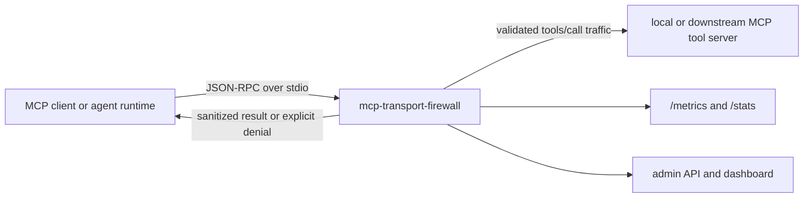

This diagram shows the primary transport boundary and the optional control-plane surfaces.

Component notes:

- the primary execution path is stdio interception between the MCP client and the downstream tool server
- Trust Gates run before downstream execution
- explicit deny responses are returned on auth, scope, color-boundary, preflight, schema, and egress violations
- read-style allow cases can be served from cache
- returned tool output is sanitized before it re-enters the client context
- the admin API, dashboard, and metrics exporter are secondary observability surfaces
